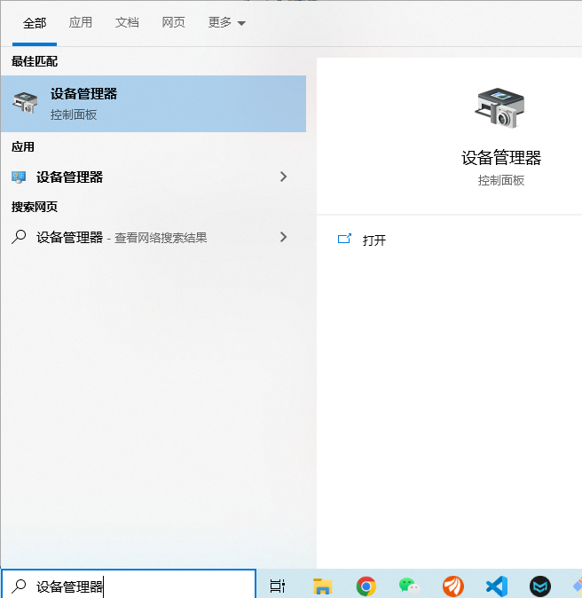

本文主要针对 Windows 小白用户来从零搭建 AI 环境，本文主要涉及的是与硬件相关的环境，主要测试测试环境如下所示，推荐采用本文使用的环境搭建：

- 系统：Windows 10
- 显卡型号：Nvidia 1080ti
- Nvidia 驱动：31.0.15.1694
- Cuda 版本：11.7.1， [CUDA 下载](https://developer.nvidia.com/cuda-toolkit-archive)
- cudnn 版本：cudnn v8.8.1 for CUDA 11.x [cudnn 下载](https://developer.nvidia.com/rdp/cudnn-download)

后续，我们会基于此环境来进行各种有趣的 AI 应用的试验，拭目以待。

## 概念理解：CUDA 与 CUDNN

- NVIDIA驱动：硬件驱动，是为了告诉系统如何使用这张显卡的。
- CUDA：NVIDIA为了构建自己的护城河而开发的高性能计算库，主要用于3D渲染和深度学习等。
- CUDNN：NVIDIA针对深度学习而开发的，在CUDA之上的深度学习工具库。

简单来说，就是如果你想加速你的AI程序的训练和推理速度，那么 CUDA 与 CUDNN 是必须的。

## 第一步 开始之前：NVIDIA 驱动检查与安装

### 1.1 NVIDIA 驱动检查：

开始之前，先检查自己的GPU是否为 Nvidia 显卡，如果是再接着进行以下的工作；如果不是，很遗憾，你的机器与 AI 基本绝缘了。查看方式如下：

- **首先去windows 下方搜索设备管理器：**



- **然后点击进去查看显示适配器：** 我的显卡为 Nvidia GTX 1080 Ti， 双击，然后切换到驱动程序，我们就可以查看我们安装的驱动，如下图所示：


### 1.2 NVIDI 驱动安装

如果很不幸，你虽然有NVIDIA显卡，但是没有安装驱动，那么就需要去 [Nvidia 驱动安装](https://www.nvidia.cn/Download/index.aspx?lang=cn) 来安装驱动，安装的过程跟普通程序安装差不多。进入该网站后选择适合自己显卡的驱动，然后点击搜索即可，如下图所示：


下载好后就按照安装提示一步步安装即可。

### 1.3 NVIDIA 驱动安装验证

- 在windows 搜索框中输入 “cmd”， 当打开命令行终端，如下所示：


- 打开终端后，输入 “nvidia-smi”，如果有如下图所示的结果，就说明NVIDIA驱动安装成功了：


## 第二步：查看 NVIDI 驱动支持的 Cuda 型号

### 2.1 NVIDIA 控制面板

在Windows搜索框中输入：Nvidia，会显示返回： **NVIDIA Control Panel 或者 Nvidia 控制面板**。点击打开


### 2.2 查看支持的CUDA 型号

- 首先，打开 NVIDIA 控制面板，点击左下角的 **“系统信息”**：


- 然后，我们点击组件，就能看到 NVCUDA64.DLL 的驱动型号了，如下图所示，我的显卡所支持的 CUDA 最高型号为： 11.7.101，那么靠前的型号都支持。


## 第三步：安装Cuda

### 3.1 下载安装 Cuda

首先，去往网站 [CUDA 下载](https://developer.nvidia.com/cuda-toolkit-archive)， 考虑到目前Pytorch 只支持到 CUDA 11.7，因此选择下载 CUDA 11.7 即可。


然后就直接按照安装提示一步步安装即可。

### 3.2 CUDA 环境变量配置

- 在Windows 搜索框中输入：环境变量，如下图所示：


- 点击打开后，点击“环境变量”：


- 点击用户变量中的 Path，点击编辑：


- 添加 CUDA 的环境变量，去 `C:\Program Files\NVIDIA GPU Computing Toolkit\CUDA` 下查看版本号，如我的的是 `v11.6`，那么我的两个环境路径就是：

```
C:\Program Files\NVIDIA GPU Computing Toolkit\CUDA\v11.6
C:\Program Files\NVIDIA GPU Computing Toolkit\CUDA\v11.6\lib\x64
```

### 3.3 CUDA 安装验证

最后，我们依旧是打开cmd，输入 `nvcc -V`，正确的输出如下图所示：


## 第四步：安装 Cudnn

- 首先，前往 [cudnn 下载](https://developer.nvidia.com/rdp/cudnn-download) 来下载 cudnn库，这里我们选择：cudnn v8.8.1 for CUDA 11.x。


- 然后，对cudnn 进行解压，最后将解压后的 bin，include，lib文件夹下的内容拷贝到 cuda 对应的 bin，include，lib 下即可。

至此，我们就完全安装了 AI 相关硬件环境。

## 最后

本篇文章对硬件相关的环境进行搭建，后续有关于软件相关的环境，会有额外的文章。 我们更倾向于将软件环境打包来提供给各位使用，拭目以待。

参考：https://zhuanlan.zhihu.com/p/337509561